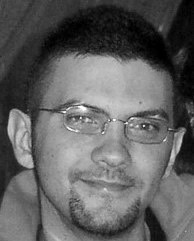

<h1 style="text-align: center">1st International Workshop on Energy Efficient Data Mining and Knowledge Discovery</h1>

 
Co-located with <a href="http://www.ecmlpkdd2018.org/" target="_blank" rel="noopener"> ECML PKDD 2018</a>  
	September 14, 2018 - Dublin, Ireland 

	 
  

    

  		<h3>KEYNOTE SPEAKERS</h3>
    

	
	<!-- Nicola -->
	

        

			
			
		

		

            
<a href="/keynote#nicola">Nicola Tonellotto</a>

            
National Research Council of Italy (ISTI)

        

        

            
<a href="/keynote#erich">Erich Elsen</a>

            
Google Brain

        

    

    
	<!-- Erich -->
   <!--  

    	

			
		

		
    
 -->
  
  

	

	This workshop aims to bring together people from many different fields
	in machine learning and data mining that have a common interest in
	energy efficiency, energy aware computing, hardware accelerators,
	and embedded systems. 
	 
	These fields include, but are not limited to: deep learning,
	big data, Internet of Things (IoT), large-scale computing,
	stream mining, and distributed machine learning. 
	 
	The goal is to provide a venue for researchers to present their work,
	exchange ideas, and discuss challenges related to energy-efficiency 
	in machine learning, data mining, and supporting hardware platforms, 
	and algorithms.
	We accept original work, already completed, or in progress.
	Position papers are also considered.
	  

	<h3> Key Dates </h3>
	<ul>
	 <li> Workshop paper submission deadline: <strike>July 2, 2018</strike> <strong>  July 12, 2018</strong></li>
	 <li> Workshop paper acceptance notification: Monday, July 30, 2018</li>
	 <li> Workshop paper camera-ready deadline: Monday, August 6, 2018</li>
	 <li> Workshop date: Friday, September 14, 2018 </li>
	</ul>
	All deadlines expire on 23:59 AOE (Anywhere On Earth).

	<h3> Workshop Chairs</h3>
	   <ul>
		<li> Eva García-Martín, Blekinge Institute of Technology</li>
		<li> Albert Bifet, Telecom-ParisTech</li>
		<li> Niklas Lavesson, Jönköping University</li>
	   </ul>
		 
	<h3> Steering Committee</h3>
	   <ul>
		<li> Veselka Boeva,  Blekinge Institute of Technology</li>
		<li> Ricardo Baeza-Yates, NTENT</li>
		<li> Håkan Grahn, Blekinge Institute of Technology</li>
		<li> Emiliano Casalicchio, Sapienza University of Rome</li>
		<li> Elena Tsiporkova, Sirris (Collective Center for the Belgian technological industry) </li>
	</ul>

  

 
